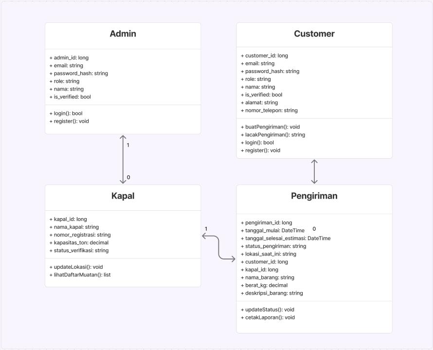
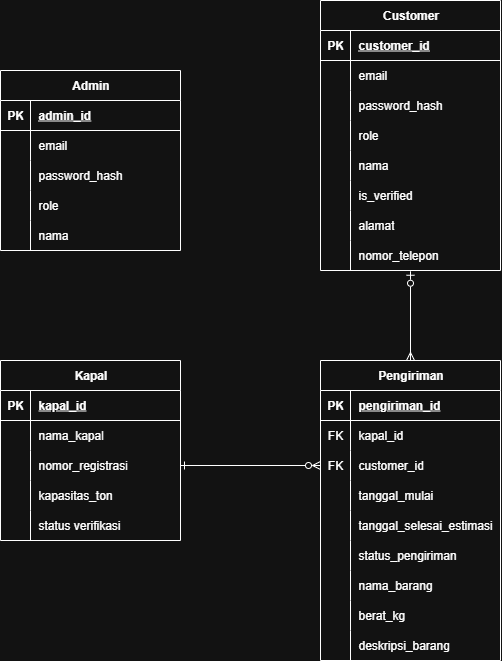

# Repositori Smartlog

## Apa ini lah 💻

| Jabatan        | Nama                       | NIM                |
| -------------- | -------------------------- | ------------------ |
| Ketua Kelompok | Polikarpus Arya Pradhanika | 23/512404/TK/56325 |
| Anggota 1      | Muhammad Rhizal Rhomadon   | 23/514719/TK/56511 |
| Anggota 2      | Argya Sabih Elysio         | 23/512630/TK/56335 |

<!-- ## Design 🎨

[Figma Link](https://www.figma.com/files/team/1230877834990330643/project/355707487/PIONIR-Gadjah-Mada-2025?fuid=1360546456182338347) -->

## How To Run 🏃🏻‍♂️

Petunjuk untuk menjalankan kode di repositori ini ada di dalam file `./wpf/README.md`

## Pull & Push Schema 💪🏻

1. Checkout to main branch
2. Pull origin main
3. Create a new branch (Please read the rule below this section)
4. Checkout to the new branch
5. Code
6. Commit (Please follow the commit messages rule)
7. Pull origin dmain
8. Push origin "your branch name"
9. Create a new pull request to main branch and merge
10. Done

## Branch Naming ✏️

`<type>/<short_description>.<nama_kamu>`

- `<type>` :
  - feature: saya menambahkan fitur baru
  - fixing: saya memperbaiki fitur

Contoh: feature/navbar.arya

## Commit message 📝

`<type>(<scope>): <short_summary>`

- `<type>` :

  - feat: saya menambahkan fitur baru
  - fix: saya memperbaiki fitur

- `<scope>` : ini opsional
- `<short_summary>` : buat sejelas mungkin

Contoh: feat[Homepage]: Creating about section

## Folder Structure 📁

```
- wpf: all wpf code
- docs: everything related to documentation
```

## Aturan Penulisan Variabel / File 📃

- Gunakan **PascalCase** untuk menulis nama komponen / file komponen website
  DefaultLayout.js, Navbar.js
- Gunakan **camelCase** untuk menulis nama variabel / file non komponen
  data.js, dataFaq.js, createdAt, dkk
- Selalu gunakan .js file! Biar keliatan rapi + seragam aja reponya.

## Notes 📰

- kalo branch mu udah di merge, jangan lupa juga buat hapus branch mu dari github (biar rapi :>)

## Class Diagram

Berikut adalah rancangan class diagram yang dibuat

<div style="text-align: center;">
  
</div>

## Entity Relation DIagram

Berikut adalah rancangan erd yang dibuat

<div style="text-align: center;">
  
</div>
